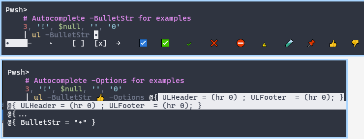

## Version 0.2.20

### Functions with `-Options` Parameters

- When a Function's parameter is named `-Options`, it takes a hashtable to modify behavior
- Internally, functions always reference `-Options` as the hashtable `$Config`. This is to make it clear it's the merged settings
- `-Options` functions often have a few templates that autocomplete. 

Settings are merged like this:
```ps1
$Config = mergeHashtable -BaseHash $DefaultValues -OtherHash $Options

# ex:
$Config = mergeHashtable -BaseHash @{ Name = 'fred' ; Region = 'east' } -OtherHash @{ Id = 4 ; Region = 'North' }
```

### Faster import

- Some things were cleaned up a bit, and I disabled some debug JSON files from writing on load.
- If import is printing any text on load, you can increase speed a bit by redirecting all streams to `$null`. (This applies to all modules).
```ps1
# silently import
Import-Module ninmonkey.Console -wa Ignore *>$null
```

- `Import-Module CompletionPredictor` is optional. 

It's not the default because it has a pretty significant import cost relative most modules.
```ps1
# my default
nin.ImportPSReadLine MyDefault_HistListView
# if you don't care about the initial import time, try the CompletionPredictor
nin.ImportPSReadLine Using_Plugin
```

### `Format-UnorderedList` aliased as `UL` and `join.UL`

- No longer errors when pipping nulls and empty strings to `Format-UnorderedList` without errors
- added a new alias `join.UL` for less ambiguity / consistency with future commands. `UL` is still defined. 



### bugfix

- Auto reset the log from `Enable-NinHistoryHandler`, if it when size >= 5MB.
- (Even before) It shouldn't have ran unless you explicitly call `Enable-NinHistoryHandler` 
- changed the message to a warning, to prevent accidentally enabling it in a profile
